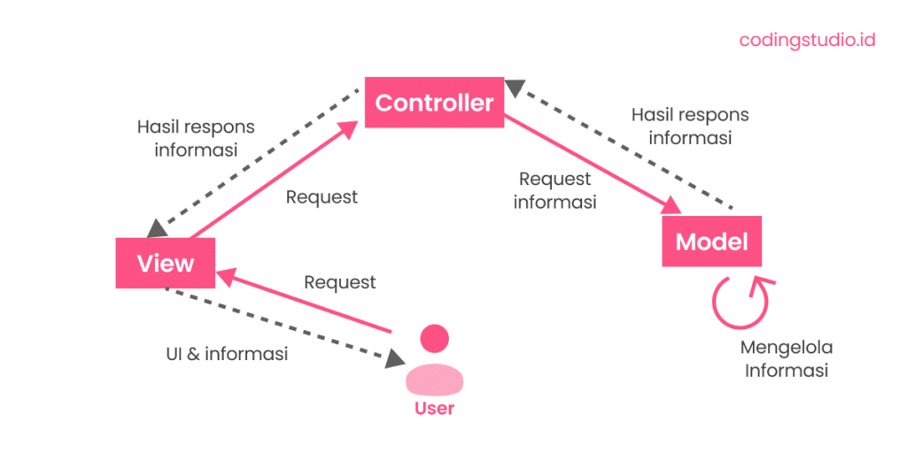

# Laporan Modul 1: Perkenalan Laravel
**Mata Kuliah:** Workshop Web Lanjut   
**Nama:** [Shaista Ifra Zia Rosant]  
**NIM:** [2024573010078]  
**Kelas:** [2B]  

---

## Abstrak 
Laporan ini bertujuan untuk pengenalan tentang framework Laravel, yang ditujukan untuk praktik. Laporan ini dimulai dengan penjelasan teoritis mengenai Laravel, mencakup definisi, karakteristik utama, serta alasan kenapa Laravel banyak digunakan dalam pengembangan web modern.

Tujuannya adalah untuk membantu peserta:
1. Memahami secara mendalam apa itu Laravel dan fungsinya.
2. Menguasai langkah-langkah instalasi dan konfigurasi awal Laravel.
3. Menerapkan pengetahuan yang didapat untuk membuat proyek Laravel.
4. Belajar mendokumentasikan proses dan hasil praktik dalam bentuk laporan yang terstruktur.

---

## 1. Pendahuluan

Laravel adalah sebuah framework PHP yang bersifat open-source, dirancang untuk membantu developer membangun aplikasi web dengan cepat dan efisien. Framework ini diciptakan oleh Taylor Otwell pada tahun 2011. Laravel menyediakan berbagai fitur dan struktur yang sudah terorganisir sehingga developer tidak perlu lagi membuat semua code dari nol.

Laravel adalah framework PHP yang kuat dan fleksibel, dirancang untuk mendukung pengembangan aplikasi berbasis MVC. Dengan fitur-fitur unggulan seperti Eloquent ORM, Blade Template Engine, dan Artisan, Laravel membantu pengembang menciptakan aplikasi yang efisien, terstruktur, dan mudah dipelihara. Jika Anda mencari framework PHP yang modern dan ramah pengembang, Laravel adalah pilihan yang tepat.

Karakteristik utama laravel beberapa diantaranya adalah:
1. Arsitektur Model-View-Controller (MVC)
    Pola ini memisahkan aplikasi menjadi tiga bagian, sehingga kode lebih rapi dan terstruktur:
    - Model: Bertanggung jawab untuk interaksi dengan database. Misalnya, data produk, data pengguna, atau  data artikel.
    - View: Mengelola tampilan yang akan dilihat oleh pengguna. Ini adalah bagian visual dari website.
    - Controller: Menjadi jembatan yang menghubungkan Model dan View, serta menangani logika aplikasi. Jadi, saat pengguna mengeklik sebuah tombol, controller yang akan memproses permintaan tersebut.
2. Sintaks yang Ekspresif
    Laravel menggunakan sintaks yang mudah dibaca dan intuitif, seperti yang terlihat pada templating engine-nya, Blade. Contohnya, untuk menampilkan data, Anda cukup menulis {{ $nama }}
3. Opinionated Framework
    Opinionated framework adalah sebuah kerangka kerja (framework) yang sudah memiliki "pendapat" atau cara yang disarankan dalam menyelesaikan suatu masalah. Artinya, framework ini memberikan aturan, struktur, dan konvensi yang sudah ditentukan untuk membangun aplikasi.
4. Alat-alat Bawaan yang Kuat:
    - Artisan: Alat command-line yang sangat membantu untuk tugas-tugas berulang, seperti membuat controller atau migration database.
    - Eloquent ORM: Sebuah Object-Relational Mapper yang memungkinkan Anda berinteraksi dengan database menggunakan   sintaks PHP yang elegan, tanpa harus menulis query SQL mentah.
    - Otentikasi & Otorisasi: Laravel menyediakan fitur login, register, dan manajemen hak akses yang sudah siap pakai.

-  Laravel sangat cocok untuk berbagai jenis aplikasi web karena framework ini dibuat untuk memudahkan  pengembangan dan mengefisienkan alur kerja. beberapa contohnya adalah:
    1. Aplikasi Web Kustom
    2. Aplikasi Skala Besar (Enterprise)
    3. Aplikasi Berbasis Layanan Mikro
    4. API RESTful

 
---

## 2. Komponen Utama Laravel (ringkas)
- Blade (templating)
    Sistem templating milik Laravel yang memungkinkan pengembang membuat tampilan HTML yang dinamis dengan sintaks yang bersih dan mudah dibaca.
- Eloquent (ORM)
   Fitur Laravel untuk mengelola database lewat model berbasis objek, sehingga query bisa dibuat tanpa menulis SQL langsung.
- Routing
    Proses mengarahkan URL ke fungsi atau controller yang menangani permintaan tersebut.
- Controllers
    Mengatur alur permintaan dari routing, memproses data, berinteraksi dengan model, lalu mengembalikan respons.
- Migrations & Seeders
    Migrations mengatur versi skema database; Seeders mengisi database dengan data awal atau uji.
- Artisan CLI
    Antarmuka perintah Laravel untuk membuat file, mengelola database, dan tugas pengembangan lainnya.
- Testing (PHPUnit)
    Fitur untuk menulis dan menjalankan tes otomatis memastikan fungsi aplikasi tetap berjalan baik.

---

## 3. Berikan penjelasan untuk setiap folder dan files yang ada didalam struktur sebuah project laravel.
**Folder utama**
    
- app: adalah inti dari aplikasi. Berisi semua kode utama, termasuk controller, model, providers, middleware, dan class lain yang menjadi logika bisnis aplikasi.
            
- bootstrap: Folder ini berisi file untuk menginisiasi (bootstrapping) framework Laravel, seperti app.php. Folder ini juga berisi cache performa yang dibuat oleh framework.
            
- config: Berisi semua file konfigurasi untuk aplikasi Anda, mulai dari konfigurasi database, services, hingga mail.
            
- database: Menyimpan semua file yang terkait dengan database, seperti migrations (untuk membuat dan            memodifikasi tabel database), seeders (untuk mengisi database dengan data awal), dan factories (untuk membuat data palsu).
            
- public: Ini adalah root folder yang bisa diakses publik. Semua permintaan web pertama kali akan masuk ke index.php di sini. Folder ini juga tempat menyimpan aset-aset seperti gambar, CSS, dan JavaScript yang bisa diakses langsung oleh browser.
            
- resources: Berisi semua aset yang belum dikompilasi, seperti views (tampilan HTML), raw CSS (misalnya dengan SASS), raw JavaScript, dan file bahasa.
            
- routes: Tempat untuk menentukan semua rute atau URL aplikasi Anda, seperti web.php untuk rute web dan api.php untuk rute API.
            
- storage: Berisi file yang dihasilkan oleh aplikasi, seperti cache, sessions, logs, dan user-uploaded files.
            
- tests: Berisi file untuk pengujian aplikasi Anda, baik itu feature tests atau unit tests.

- vendor: Berisi semua pustaka (library) dan dependensi yang diinstal melalui Composer. Anda tidak perlu menyentuh atau memodifikasi folder ini secara manual.

**File utama**

- .env: Ini adalah file yang sangat penting. Berisi variabel-variabel konfigurasi lingkungan, seperti kredensial database dan kunci aplikasi. Nilai-nilai di sini bisa berbeda antara lingkungan lokal dan produksi.

- .env.example: Contoh file .env. Berguna sebagai panduan bagi developer lain untuk membuat file .env mereka sendiri.

- .gitignore: File ini memberi tahu Git file atau folder mana saja yang harus diabaikan dan tidak perlu diunggah ke repositori, seperti folder vendor/ dan file .env.

- artisan: File eksekusi untuk menjalankan Artisan CLI (Command Line Interface). Dengan file ini, Anda bisa menjalankan perintah-perintah seperti php artisan make:controller atau php artisan migrate.

- composer.json: File ini mendefinisikan semua dependensi yang dibutuhkan oleh proyek Anda dan detail lain tentang proyek.

- package.json: Mirip dengan composer.json, tetapi digunakan untuk mengelola dependensi Node.js (frontend), seperti Bootstrap atau Vite.

---

## 4. Diagram MVC dan Cara kerjanya
> 

**Cara kerja MVC (Model–View–Controller)**
1. 	View → Bagian yang berinteraksi langsung dengan pengguna. Saat pengguna melakukan aksi (misalnya klik tombol atau isi form), View mengirimkan permintaan ke Controller.
2. 	Controller → Otak pengatur alur. Controller menerima permintaan dari View, lalu memutuskan apa yang harus dilakukan—misalnya mengambil atau memproses data lewat Model. Setelah itu, Controller mengirimkan hasilnya kembali ke View.
3. 	Model → Pengelola data dan logika bisnis. Model mengambil, menyimpan, atau memanipulasi data (biasanya dari database) sesuai instruksi Controller, lalu mengembalikan data tersebut.
---

## 6. Kelebihan & Kekurangan (refleksi singkat)
Laravel menjadi salah satu framework PHP favorit banyak pengembang web karena menawarkan berbagai kelebihan.
- Sintaks yang Bersih dan Jelas: Laravel memiliki sintaks yang bersih dan mudah dimengerti. Hal ini memungkinkan para pengembang untuk menulis kode dengan cepat dan efisien.
- Dukungan Model-View-Controller (MVC): Dengan menggunakan pola desain MVC, Laravel memisahkan logika aplikasi menjadi tiga komponen utama, yaitu model, view, dan controller. Ini membuat pengembangan dan pemeliharaan aplikasi menjadi lebih mudah.
- Eloquent ORM: Laravel dilengkapi dengan Eloquent ORM, yang memungkinkan pengembang untuk berinteraksi dengan database menggunakan objek dan metode. Ini membuat manipulasi database menjadi lebih sederhana dan efisien.
- Keamanan yang Tinggi: Laravel menyediakan berbagai lapisan keamanan, termasuk proteksi terhadap serangan SQL injection, serangan cross-site scripting (XSS), dan serangan cross-site request forgery (CSRF). Keamanan ini telah menjadikan Laravel pilihan favorit untuk pengembangan aplikasi web yang aman.
- Paket Bawaan yang Kuat: Laravel memiliki banyak paket bawaan yang membantu pengembang untuk menambahkan fungsionalitas tambahan ke aplikasi mereka dengan mudah, seperti otentikasi pengguna, pengelolaan sesi, dan pengiriman email.
- Dokumentasi yang Baik: Laravel memiliki dokumentasi yang sangat baik dan komunitas yang besar. Ini sangat membantu pengembang dalam memahami framework dan menyelesaikan masalah dengan cepat.

Meskipun Laravel memiliki banyak keunggulan, terdapat beberapa keterbatasan yang perlu diperhatikan
dalam penggunaannya, yaitu:

- Kinerja Tertentu: Meskipun Laravel sangat mudah digunakan, beberapa pengembang merasa bahwa kinerjanya tidak secepat beberapa framework PHP lainnya, terutama dalam mengelola permintaan tinggi.
- Ketergantungan pada Komposer: Laravel sangat tergantung pada Composer, manajer paket PHP. Ini bisa menjadi masalah jika pengembang tidak akrab dengan Composer atau jika terjadi konflik versi paket.
- Kesulitan dalam Migrasi dari Versi Lama: Pengembang yang ingin beralih dari versi lama Laravel ke versi terbaru mungkin menghadapi tantangan migrasi karena perubahan signifikan dalam struktur dan sintaks.
- Kurangnya Kustomisasi: Beberapa pengembang merasa bahwa tingkat kustomisasi dalam Laravel terbatas jika dibandingkan dengan beberapa framework lain. Pengembang mungkin merasa terbatas ketika mencoba mengubah perilaku bawaan framework.
- Kesulitan dalam Pembelajaran Awal: Meskipun Laravel memiliki dokumentasi yang baik, pengembang pemula mungkin menghadapi kesulitan dalam memahami beberapa konsep yang kompleks, terutama jika mereka belum memiliki pengalaman dengan framework PHP sebelumnya.

---

## 7. Referensi

- **Laravel Documentation** - https://laravel.com/docs
- **Laravel Arsitektur MVC yang Mudah dan Elegan** - https://embuncode.blogspot.com/2024/12/laravel-arsitektur-mvc-yang-mudah-dan.html
- **kelebihan dan kekurangan framework php laravel** - https://baraka.uma.ac.id/kelebihan-dan-kekurangan-framework-php-laravel/

---
