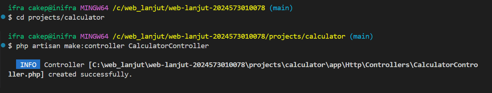

# Laporan Modul 2: Laravel Fundamentasl
**Mata Kuliah:** Workshop Web Lanjut   
**Nama:** Shaista Ifra Zia Rosant  
**NIM:** 2024573010078  
**Kelas:** 2B   

---

## Abstrak 

Laporan ini membahas dasar Laravel seperti MVC, Routing, Middleware, request-response, dan Blade melalui contoh praktikum. Tujuan pembuatan laporan adalah untuk mendokumentasikan hasil praktikum secara sistematis, dan memahami penerapan konsep laravel dalam praktik.

---

## 1. Dasar Teori

- MVC (Model-View-Controller) adalah sebuah desain arsitektur perangkat lunak yang digunakan untuk memisahkan komponen-komponen dalam sebuah aplikasi. Setiap komponen memiliki tanggung jawab dan peran yang berbeda dalam aplikasi.
Model adalah bagian yang menangani data dan logika bisnis. Model berhubungan langsung dengan database, misalnya mengambil, menyimpan, atau memproses data.
View adalah bagian yang menampilkan data kepada pengguna. Biasanya berupa antarmuka (UI) seperti halaman web atau form.
Controller adalah bagian yang mengatur alur aplikasi. Controller menerima input dari pengguna, lalu memprosesnya dengan bantuan Model, setelah itu mengirim hasilnya ke View.

- Routing di Laravel adalah mekanisme untuk menentukan rute (path/URL) yang akan mengarahkan request dari user (biasanya lewat browser) ke controller, view, atau closure (fungsi langsung).

- Middleware berfungsi sebagai lapisan perangkat lunak perantara yang menghubungkan berbagai aplikasi dan memfasilitasi komunikasi serta pertukaran data di antara sistem yang berbeda, yang memungkinkan pengembang untuk fokus pada logika aplikasi inti mereka

- Laravel menangani Request dan Response menggunakan model arsitektur yang terstruktur, dimulai dari saat permintaan masuk ke server hingga tanggapan dikirim kembali ke pengguna. Proses ini memastikan setiap permintaan diproses secara efisien dan aman.

- Controller berfungsi sebagai penghubung antara pengguna dan sistem. saat ada permintaan dari pengguna melalui URL atau form, controller akan memproses permintaan tersebut, memanggil data dari model jika diperlukan, lalu meneruskan hasilnya ke view. Dengan begitu, controller mengatur alur kerja aplikasi dan memastikan setiap request mendapatkan respons yang sesuai.
View adalah bagian yang menampilkan informasi kepada pengguna. View hanya berfokus pada tampilan antarmuka, misalnya menampilkan data dari model yang sudah diolah oleh controller. Dengan adanya view, data bisa disajikan dalam bentuk yang mudah dipahami pengguna, seperti halaman web, tabel, atau formulir.

- Fungsi Blade Templating Engine di Laravel adalah untuk membuat penulisan view (tampilan) menjadi lebih mudah dan terstruktur. Blade memungkinkan Anda menggunakan sintaks yang lebih bersih dan ringkas untuk menulis HTML, sekaligus menyisipkan logika PHP dan data dari aplikasi.
---

## 2. Langkah-Langkah Praktikum
Tuliskan langkah-langkah yang sudah dilakukan, sertakan potongan kode dan screenshot hasil.

2.1 Praktikum 1 – Route, Controller, dan Blade View 

- Tambahkan route pada routes/web.php.
- Buat controller WelcomeController.
- Buat view mywelcome.blade.php.
- Jalankan aplikasi dan tunjukkan hasil di browser.

Screenshot Hasil:

2.2 Praktikum 2 – Membuat Aplikasi Sederhana "Calculator"

- Tambahkan route untuk kalkulator.
- Buat controller CalculatorController.
- Tambahkan view calculator.blade.php.
- Jalankan aplikasi dan coba dengan beberapa input berbeda.

Screenshot Hasil:

 
 
 

---

## 3. Hasil dan Pembahasan

- Apakah aplikasi berjalan sesuai harapan?
    Aplikasi kalkulator yang dibuat dengan Laravel dapat berjalan sesuai rancangan. Saat user membuka halaman /calculator, aplikasi menampilkan form berisi dua input angka dan opsi operator matematika. Setelah user mengirimkan data, sistem memproses perhitungan dan menampilkan hasilnya langsung pada halaman tersebut.

- Apa yang terjadi jika ada input yang salah (misalnya pembagian dengan 0)?
    Jika terjadi input yang salah, misalnya user mencoba melakukan pembagian dengan angka nol, aplikasi akan menampilkan pesan error “Error: Division by 0”. Hal ini menunjukkan bahwa sistem sudah menangani kondisi tidak valid tersebut, sehingga tidak menyebabkan aplikasi berhenti mendadak. 

- Bagaimana validasi input bekerja di Laravel?
    Validasi input di Laravel bekerja dengan memeriksa data yang masuk sebelum diproses. Proses ini bisa dilakukan langsung di dalam controller menggunakan method $request->validate(), atau dengan membuat Form Request khusus. Aturan validasi ditulis dalam bentuk array, misalnya ['angka1' => 'required|numeric'], yang berarti input wajib diisi dan harus berupa angka. Jika data tidak sesuai aturan, Laravel otomatis mengembalikan pesan error dan menghentikan proses, sehingga aplikasi lebih aman dan terhindar dari input yang tidak valid.

- Apa peran masing-masing komponen (Route, Controller, View) dalam program yang dibuat?
    - Route berfungsi sebagai penghubung URL dengan logika aplikasi. Misalnya, ketika pengguna mengakses /calculator, route akan mengarahkan permintaan tersebut ke controller yang sesuai.
    - Controller menangani logika utama aplikasi. Controller menerima input dari pengguna, melakukan validasi, memproses perhitungan sesuai operator, lalu menyiapkan hasil yang akan ditampilkan.
    - View bertugas menyajikan tampilan kepada pengguna. Dalam kasus ini, view menampilkan form kalkulator serta hasil perhitungan atau pesan error jika terjadi kesalahan input.

---

## 4. Kesimpulan

Praktikum ini membantu memahami dasar penggunaan Laravel dan memudahkan pengembangan aplikasi web dengan konsep MVC. Melalui routing, controller, dan view, aplikasi dapat diatur alurnya dengan jelas serta dipisahkan antara logika dan tampilan. Middleware dan validasi input berperan penting untuk menjaga keamanan serta keandalan aplikasi. Implementasi kalkulator sederhana menunjukkan bahwa Laravel mampu menangani proses input, perhitungan, dan penanganan error secara efektif.  

---

## 5. Referensi
Cantumkan sumber yang Anda baca (buku, artikel, dokumentasi) — minimal 2 sumber. Gunakan format sederhana (judul — URL).

- **Laravel Fundamental** - https://hackmd.io/@mohdrzu/B1zwKEK5xe#Praktikum-3---Laporan-Praktikum

- **Belajar Laravel** - https://digilib.stekom.ac.id/assets/dokumen/ebook/feb_B8-GOdzvXQ0qiJqdyUjO6ryV7949c7dfgjGg8zeDkwjSqdYD-3nRT5A_1688373637.pdf

---
